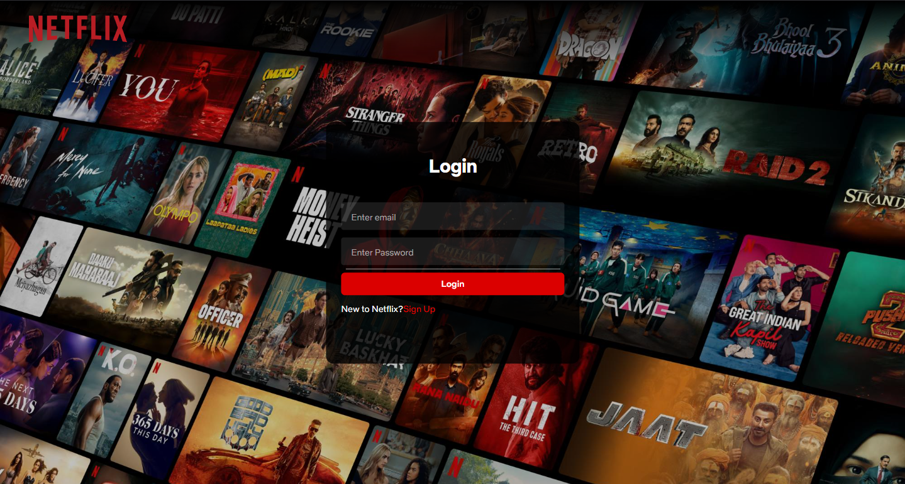
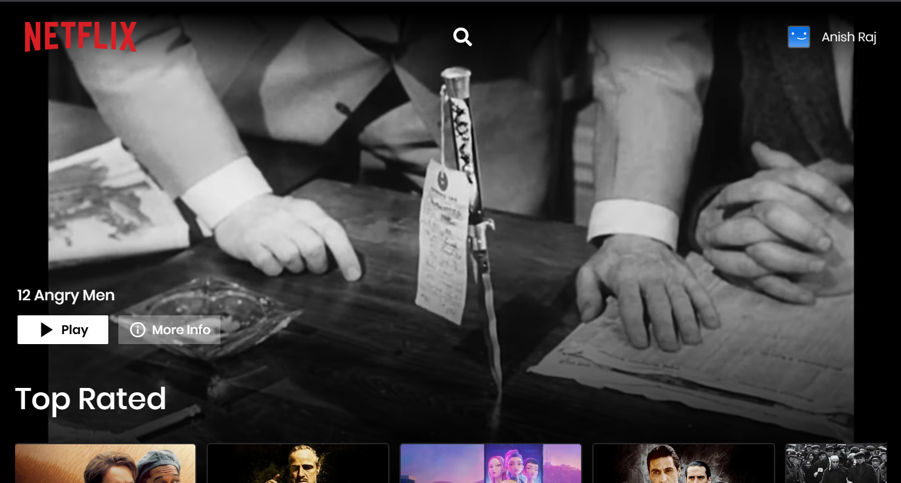
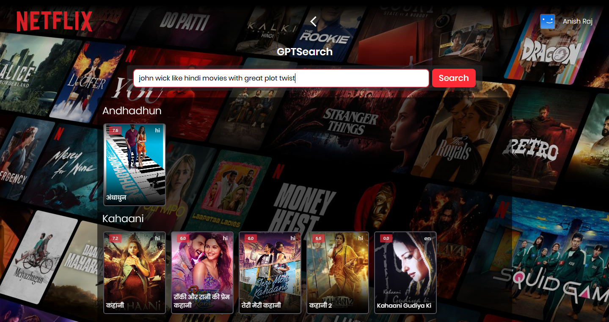
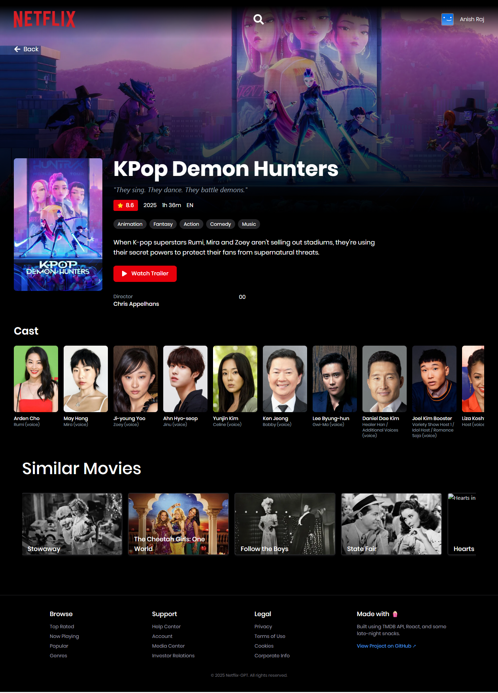

# 🎬 Netflix GPT — Your AI Movie Companion

> _An AI-powered movie discovery app inspired by Netflix’s sleek interface and enhanced with the intelligence of Google Gemini._  
> Built with React, TypeScript, Firebase, and TMDB as part of the **Namaste React** course — and fueled by a passion for learning and experimentation.

> _"Browse smarter, search deeper, and let AI suggest what to watch next."_

🔗 **Live Demo**: [anish-movie.netlify.app](https://anish-movie.netlify.app)  
📂 **Codebase**: [github.com/anishraj-coder/netflix-gpt](https://github.com/anishraj-coder/netflix-gpt)

---

## ⚠️ API Key Notice

> 🛠 **Important!**  
> This project requires **your own API keys** for:
>
> - 🎬 **TMDB (The Movie Database)** – to fetch movie metadata and trailers
> - 🤖 **Gemini AI (Google GenAI)** – to power the free-text GPT movie search
>
> You **must sign up** and get your personal keys:
>
> 🔑 TMDB API Key → [https://developers.themoviedb.org/3](https://developers.themoviedb.org/3)  
> 🔑 Gemini API Key → [https://aistudio.google.com/app/apikey](https://aistudio.google.com/app/apikey)

You'll be asked to paste these into your `.env` file. Don’t worry — everything is pre-configured to make that easy.

---

## 💡 About This Project

**Netflix GPT** is a personalized, AI-powered movie streaming UI that brings together two powerful ideas:

1. 🎥 The immersive aesthetic of **Netflix**, including browsing by genre, watching trailers, and seeing cast data
2. 🤖 The intelligence of **Google Gemini**, which can analyze your movie mood and suggest films just for you

Originally built as part of the **Namaste React** course, the project quickly grew into something much more hands-on, giving me a space to explore:

- Realtime interactive UI challenges
- Fire-and-forget AI prompt handling
- My first real-world API key deployment
- Building _magic_ into a streaming app through async AI + movie database querying

---

## ✨ Features

Let’s break down everything this app can do:

### 🔐 Authentication with Firebase
- Secure login/signup using **Firebase Auth**
- Email/password system
- Protected routes that prevent access without login

### 🧠 GPT-Powered AI Movie Search
- Ask in **natural language**:
  > “Give me action movies like Mission Impossible”  
  > “Suggest emotional Korean dramas”  
  > “Feel-good movies to watch on a rainy afternoon”
- Your input is parsed by Google **Gemini AI**, and real titles are pulled via **TMDB**

### 🎞 Dynamic Movie Browsing
- Home page shows movies by:
    - Top Rated
    - Now Playing
    - Popular
- Fully built using **TMDB API** and **React Query caching**

### 🎬 Movie Details Popup
- See cast members
- View runtime, genres, release date, and IMDB-like ratings
- Trailer autoplays as a full-screen hero banner on desktop

### 📱 Responsive + Mobile-Friendly
- Works beautifully on all screen sizes
- Built with Tailwind CSS and responsive containers

### 🎨 Animations & UX Polish
- Smooth scaling on hovers
- AnimatePresence and motion effects powered by `@motion`

---

## 🧠 What I Learned

This project helped me learn:

- How to **use `.env` to protect API keys**
- Dealing with **AI unpredictability** in data responses
- Using **Zustand** for slice-based global state (like user authentication)
- Fetching and caching external data using **React Query**
- Writing modular, readable code in **TypeScript**
- **Routing with Suspense/Lazy loading** to avoid bundle bloat

---

## 🛠 Tech Stack

| Category     | Tools |
|--------------|-------|
| **Frontend** | React 19, Vite, TypeScript |
| **Styling** | Tailwind CSS, Netflix Sans + Poppins fonts |
| **Routing** | React Router DOM 7 (with lazy-loading) |
| **Authentication** | Firebase Auth |
| **APIs** | TMDB API, Google Gemini (via @google/genai) |
| **State Management** | Zustand (for auth), React Query (for API cache) |
| **Dev Tools** | Vite, React Query Devtools, GitHub Actions |
| **Animations** | Framer Motion (`motion/react`) |

## 🖼️ Screenshots

Below are some visual highlights of the Netflix GPT experience:

### 🔐 Login / Sign Up


---

### 🏠 Home — Trending / Top Rated / Popular Movies


---

### 🤖 GPT Movie Search Interface


---

### 🎬 Movie Details — Info, Trailer, Cast


---

## 🧭 Project Directory Structure

```
📁 netflix-gpt/
├── 📁 public/         → Static assets (fonts, movies, favicons)
├── 📁 src/
│   ├── 📁 api/        → Axios TMDB API calls setup
│   ├── 📁 components/ → UI: Hero, Cards, Footer, Header, Search
│   ├── 📁 pages/      → Routes: Login, Browse, GPT Search, Details
│   ├── 📁 Hooks/      → React Query hooks & Gemini integrations
│   ├── 📁 store/      → Zustand state (user login, routing, etc.)
│   ├── 📁 utils/      → Constants, Gemini prompt handlers
│   └── 🧠 App.tsx     → Terminal entry point
```

---

## 🛠 Running Locally

### ✔️ Requirements

- Node.js (v16 or higher)
- Your personal API keys for:
    - TMDB
    - Google Gemini (GenAI)
    - Firebase Auth setup

---

### ⚙️ Step-by-Step Setup

1. **Clone the repository**

```bash
git clone https://github.com/anishraj-coder/netflix-gpt.git
cd netflix-gpt
```

2. **Install dependencies**

```bash
npm install
```

3. **Create your `.env` file**

```env
# Firebase Auth
VITE_FIREBASE_API_KEY=your_firebase_key
VITE_FIREBASE_AUTH_DOMAIN=your_project.firebaseapp.com
VITE_FIREBASE_PROJECT_ID=netflix-gpt-b09ea
VITE_FIREBASE_STORAGE_BUCKET=netflix-gpt-b09ea.appspot.com
VITE_FIREBASE_MESSAGING_SENDER_ID=XXX
VITE_FIREBASE_APP_ID=XXX

# TMDB API
VITE_ACCESS_TOKEN=Bearer YOUR_TMDB_BEARER_TOKEN

# Gemini API (NOTE: reverse obfuscation is done inside code)
VITE_GEMINI_API_KEY=your_gemini_api_key
```

4. **Run the Development Server**

```bash
npm run dev
```

App should be running on: `http://localhost:5173`

---

## 🚀 Roadmap & Future Enhancements

Here are things I’d love to build next:

- 📝 Local watchlist saved via Firebase or Supabase
- 🗣️ Voice-based GPT movie search
- 🌐 i18n/multi-language support
- 🎧 Add music/soundtracks to experience
- 🍿 Social feature: “What are friends watching?”
- 📊 Usage metrics & analytics

---

## 🙋 About the Developer

✨ Hi, I’m **Anish Raj** – a developer who loves building UI-rich applications and exploring AI integrations.

Netflix GPT was my first major project involving **AI**, **real APIs**, and **auth logic** — and I had a great time building it for fun and learning.

Feel free to:
- ⭐ Star this repo if you liked it
- 💬 Share ideas through issues or PRs
- 💡 Fork and customize it for your own inspirations!

📬 Contact Me:
- GitHub → [@anishraj-coder](https://github.com/anishraj-coder)
- Email → anishrajdmk@gmail.com

---

## ⭐ If You Liked This Project...

✅ Try the **Live Demo**: [anish-movie.netlify.app](https://anish-movie.netlify.app)  
✅ Star this repo for support ⭐  
✅ Leave feedback via issue or [email me](mailto:anirajdmk@gmail.com)

> Thanks for reading — and enjoy letting AI help you pick your next favorite movie 🎥🍿

